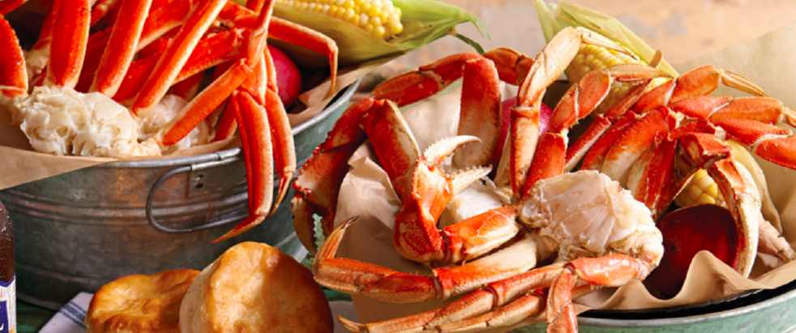

```html

<!-- p-cards -->
<div class="m-5">
    <p-card header="Order" [style]="{'width': '80%', 'margin': '0 auto'}">
        <p>Coming Soon!</p>
    </p-card>
</div>

<div class="my-5">
    <p-card header="About" [style]="{'width': '80%', 'margin': '0 auto'}">
        <p>Lorem ipsum dolor sit amet, consectetur adipisicing elit. Inventore sed consequuntur error repudiandae numquam deserunt
            quisquam repellat libero asperiores earum nam nobis, culpa ratione quam perferendis esse, cupiditate neque quas!</p>
    </p-card>
</div>

<p-card header="Home" [style]="{'text-align': 'center', 'width': '80%', 'margin': '0 auto'}">
    <p>Lorem ipsum dolor sit amet, consectetur adipisicing elit. Inventore sed consequuntur error repudiandae numquam deserunt
        quisquam repellat libero asperiores earum nam nobis, culpa ratione quam perferendis esse, cupiditate neque quas!</p>
</p-card>

<div class="m-5">
    <p-card header="Menu" [style]="{'width': '80%', 'margin': '0 auto'}">
        <p>Lorem ipsum dolor sit amet, consectetur adipisicing elit. Inventore sed consequuntur error repudiandae numquam deserunt
            quisquam repellat libero asperiores earum nam nobis, culpa ratione quam perferendis esse, cupiditate neque quas!</p>
    </p-card>
</div>

<!-- image -->



```